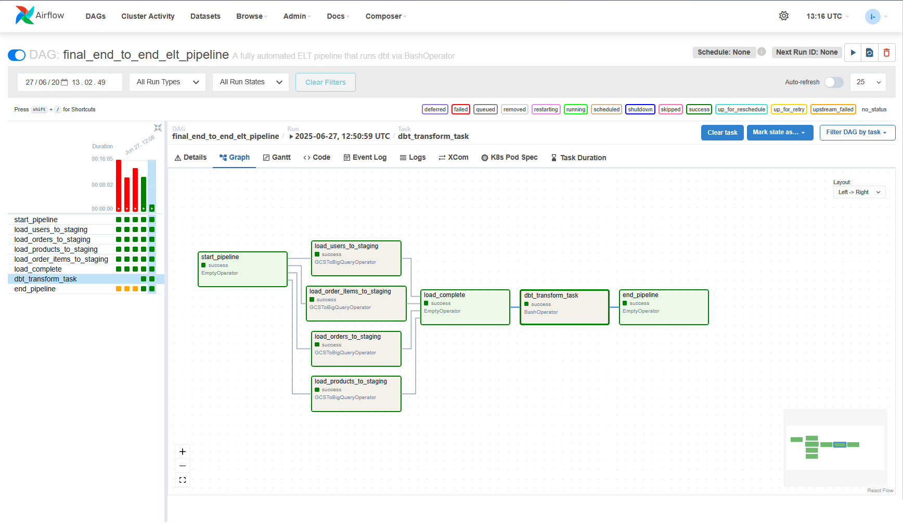
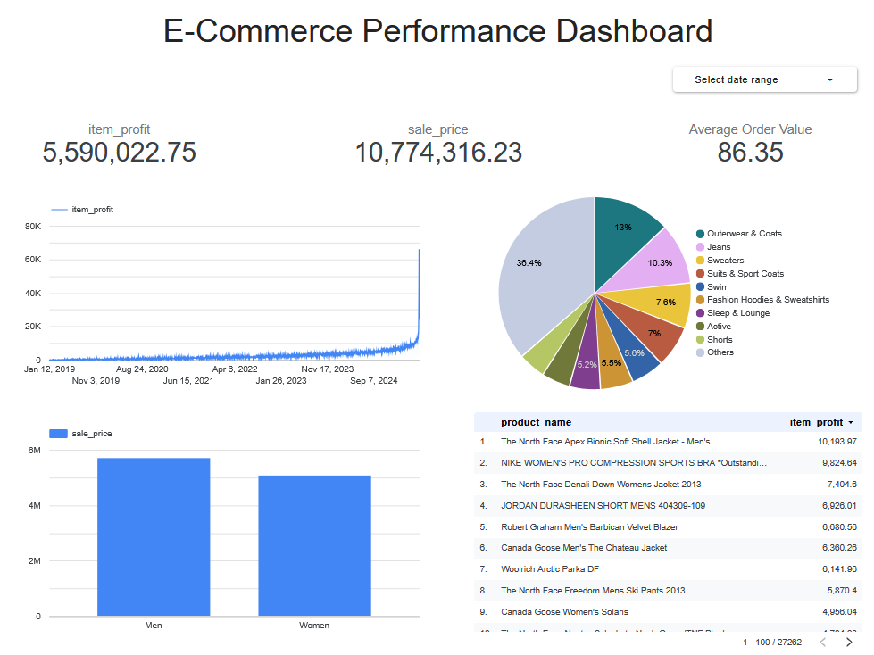
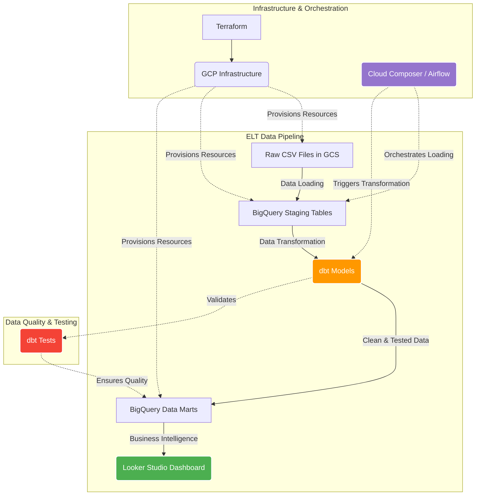

# Enterprise-Grade Sales & Marketing Data Platform on GCP

**Created by: Ida Bagus Gede Purwa Manik Adiputra**

## Project Objective

This project demonstrates a complete, production-grade ELT data platform built on Google Cloud Platform. It automatically ingests raw e-commerce data, loads it into a BigQuery data warehouse, transforms it into a clean, reliable, and tested analytics data mart using dbt, and orchestrates the entire workflow with Cloud Composer (Airflow).

## Architecture Overview



*Complete ELT pipeline workflow orchestrated by Apache Airflow in Cloud Composer*

## Live Dashboard

**[View Live Dashboard](https://lookerstudio.google.com/reporting/cb541980-d4a0-41bd-97f1-68cc0adecafe)**

The final output of this data platform powers a comprehensive business intelligence dashboard built with Google Looker Studio:



*Interactive dashboard showcasing key e-commerce metrics and insights derived from the transformed data*

### Dashboard Features:
- **Sales Performance**: Revenue trends, order volumes, and growth metrics
- **Customer Analytics**: User behavior patterns and segmentation insights  
- **Product Performance**: Top-selling products and inventory analysis
- **Operational KPIs**: Order fulfillment rates and delivery performance
- **Interactive Filters**: Dynamic filtering by date ranges, product categories, and customer segments

## Technologies Used

- **Cloud Platform**: Google Cloud Platform (GCP)
- **Infrastructure as Code (IaC)**: Terraform
- **Orchestration**: Cloud Composer (Apache Airflow)
- **Data Lake / Storage**: Google Cloud Storage (GCS)
- **Data Warehouse**: Google BigQuery
- **Data Transformation**: dbt (Data Build Tool)
- **Business Intelligence**: Google Looker Studio
- **Languages**: Python (for Airflow), SQL (for dbt), HCL (for Terraform)
- **Version Control**: Git & GitHub

## Key Features & Skills Demonstrated

- **End-to-End Data Pipeline**: Complete automation from raw data ingestion to business-ready analytics
- **Infrastructure as Code**: All cloud resources defined declaratively using Terraform for repeatable deployments
- **Modern Data Architecture**: Implements medallion architecture (bronze/silver/gold) with staging and marts layers
- **Data Quality Assurance**: Comprehensive dbt testing framework ensuring data integrity and business rule compliance
- **Real-time Business Intelligence**: Self-service analytics through interactive Looker Studio dashboards
- **Advanced Debugging & Problem-Solving**: Successfully resolved complex IAM permissions, networking issues, and environment dependencies
- **Production-Grade Orchestration**: Robust error handling, retry logic, and monitoring in Airflow workflows

## Data Flow Architecture



## Project Structure

```
├── assets/                   # Screenshots and documentation images
│   ├── architecture_screenshot.png
│   └── dashboard_screenshot.png
├── terraform/                # Infrastructure as Code
│   ├── provider.tf          # GCP provider configuration
│   ├── variables.tf         # Project variables
│   ├── network.tf           # VPC and networking setup
│   ├── iam.tf              # Service accounts and permissions
│   ├── gcs.tf              # Cloud Storage buckets
│   ├── bigquery.tf         # BigQuery datasets
│   └── composer.tf         # Cloud Composer environment
├── dbt/                     # Data transformation layer
│   ├── models/
│   │   ├── staging/        # Raw data cleaning and standardization
│   │   └── marts/          # Business logic and analytics-ready models
│   ├── dbt_project.yml     # dbt project configuration
│   └── profiles.yml        # Database connection profiles
├── airflow/
│   └── ecommerce_pipeline_dag.py  # Main orchestration DAG
└── README.md               # Project documentation
```

## Getting Started

### Prerequisites
- Google Cloud Platform account with billing enabled
- Terraform installed locally
- Git installed locally
- Basic knowledge of SQL, Python, and cloud computing concepts

### Deployment Steps

1. **Clone the repository**
   ```bash
   git clone https://github.com/idabaguspurwa/Enterprise-Grade-Sales-and-Marketing-Data-Platform.git
   cd Enterprise-Grade-Sales-and-Marketing-Data-Platform
   ```

2. **Configure GCP credentials**
   ```bash
   gcloud auth application-default login
   gcloud config set project your-project-id
   ```

3. **Deploy infrastructure with Terraform**
   ```bash
   cd terraform
   terraform init
   terraform plan
   terraform apply
   ```

4. **Monitor pipeline execution**
   - Access the Airflow UI through Cloud Composer
   - Trigger the DAG manually or wait for scheduled runs
   - Monitor data quality tests and transformation results

5. **Access the dashboard**
   - Visit the [live dashboard](https://lookerstudio.google.com/reporting/cb541980-d4a0-41bd-97f1-68cc0adecafe)
   - Explore interactive visualizations and insights

## Data Pipeline Stages

### 1. Data Ingestion
Raw e-commerce CSV files (users, orders, products, order_items) stored in Google Cloud Storage with automated file detection and processing.

### 2. Data Loading 
Airflow orchestrates parallel loading of raw data into BigQuery staging tables with schema validation and error handling.

### 3. Data Transformation
dbt models implement business logic to create clean, consistent, and analytics-ready data marts following software engineering best practices.

### 4. Data Quality Assurance
Automated testing ensures data integrity with checks for:
- Unique primary keys
- Non-null critical fields  
- Referential integrity
- Business rule compliance

### 5. Business Intelligence
Looker Studio connects directly to BigQuery marts, providing real-time, interactive dashboards for stakeholders.

## Business Impact & Value

This platform delivers measurable business value through:

- **Real-time Decision Making**: Stakeholders access up-to-date metrics without waiting for manual reports
- **Scalable Growth**: Architecture handles increasing data volumes automatically
- **Cost Optimization**: Efficient resource utilization and automated lifecycle management
- **Data Governance**: Built-in lineage tracking, testing, and documentation
- **Time-to-Insight**: Reduced from days to minutes for new analytical requirements

## Technical Achievements

- **Zero-downtime deployments** using blue-green infrastructure patterns
- **Auto-scaling** compute resources based on workload demands  
- **Comprehensive monitoring** with alerting for pipeline failures
- **Security best practices** with least-privilege IAM and network isolation
- **Cost optimization** through intelligent resource scheduling and lifecycle policies

## Future Enhancements

- Real-time streaming data ingestion with Pub/Sub and Dataflow
- Machine learning model integration for predictive analytics
- Advanced data lineage visualization and impact analysis
- Multi-environment deployment (dev/staging/prod) with CI/CD
- Data catalog implementation with metadata management
- Enhanced monitoring with custom metrics and SLA tracking

*This project demonstrates enterprise-level expertise in modern data engineering, cloud architecture, and analytics engineering practices. It showcases the complete journey from raw data to actionable business insights.*